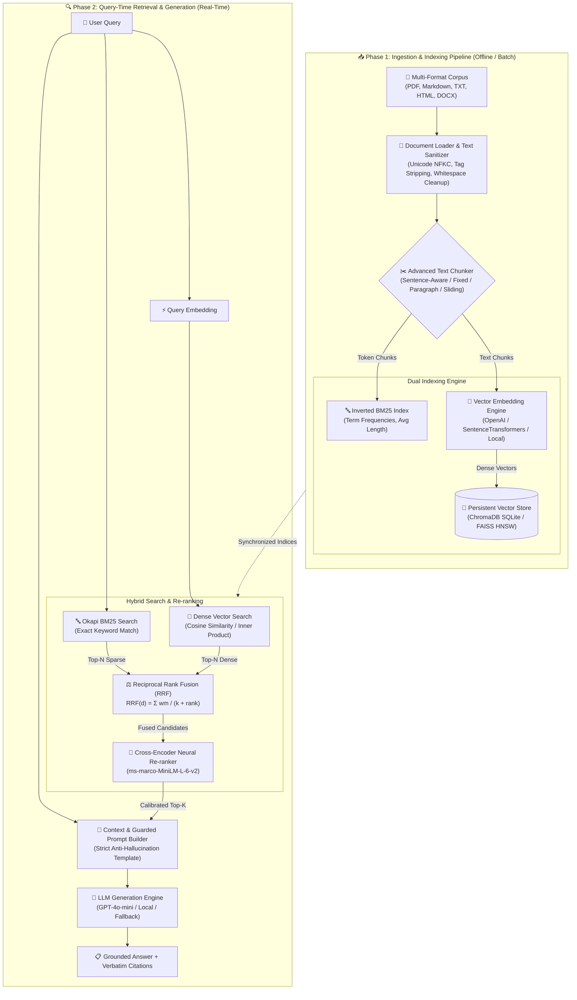
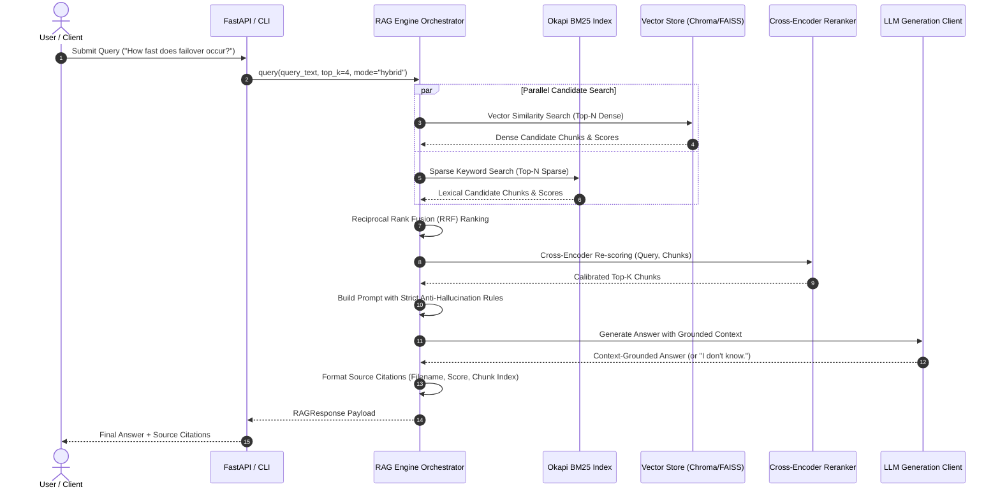

# ⚡ Production-Ready Retrieval-Augmented Generation (RAG) Pipeline

[](https://www.python.org/)
[](https://fastapi.tiangolo.com/)
[](https://streamlit.io/)
[](https://www.trychroma.com/)
[](https://github.com/facebookresearch/faiss)
[](https://www.docker.com/)
[](https://opensource.org/licenses/MIT)
[]()

> A modular, high-performance **Retrieval-Augmented Generation (RAG)** pipeline engineered from first principles in Python. Features multi-format ingestion, 4 distinct chunking strategies, pluggable embeddings, dual persistent vector store engines (ChromaDB & FAISS), hybrid search (Dense + Okapi BM25) with Reciprocal Rank Fusion (RRF), cross-encoder neural re-ranking, anti-hallucination guardrails with exact source citations, an automated IR evaluation suite, a FastAPI REST API, and a 3-tab interactive Streamlit dashboard.

---

## 📑 Table of Contents

- [🌟 System Architecture](#-system-architecture)
- [🔄 Dual-Phase Execution Flow](#-dual-phase-execution-flow)
- [✨ Core Capabilities & Feature Highlights](#-core-capabilities--feature-highlights)
- [🧮 Theoretical & Algorithmic Foundations](#-theoretical--algorithmic-foundations)
- [📂 Code Structure & Organization](#-code-structure--organization)
- [⚡ Quickstart & Local Setup](#-quickstart--local-setup)
- [🖥️ Running the Application](#-running-the-application)
- [🐳 Docker & Containerized Deployment](#-docker--containerized-deployment)
- [🔌 REST API Reference](#-rest-api-reference)
- [📊 Evaluation Benchmark Results](#-evaluation-benchmark-results)
- [🧪 Testing & Verification](#-testing--verification)
- [📚 Extended Documentation Links](#-extended-documentation-links)

---

## 🌟 System Architecture



---

## 🔄 Dual-Phase Execution Flow



---

## ✨ Core Capabilities & Feature Highlights

| Component | Capabilities |
| :--- | :--- |
| **Multi-Format Ingestion** | Native loaders for `.pdf`, `.md`, `.txt`, `.html`, and `.docx` with Unicode NFKC normalization, HTML cleaning, and whitespace standardization. |
| **4 Chunking Strategies** | **Sentence-Aware** (preserves complete grammatical thoughts), **Fixed-Size**, **Paragraph-Aware**, and **Sliding-Window** splitters with configurable token windows and overlap. |
| **Pluggable Embeddings** | **OpenAI** (`text-embedding-3-small`, `text-embedding-3-large`), **HuggingFace SentenceTransformers** (`all-MiniLM-L6-v2`), and **Deterministic Mock Embeddings** for zero-dependency offline runs. |
| **Dual Vector Stores** | Drop-in support for **ChromaDB** (persistent SQLite backend) and **FAISS** (IndexFlatIP vector index with metadata disk serialization). |
| **Hybrid Search & Fusion** | Combines dense semantic vector retrieval with sparse **Okapi BM25** keyword search using **Reciprocal Rank Fusion (RRF)**. |
| **Neural Re-ranking** | Deep **Cross-Encoder** (`ms-marco-MiniLM-L-6-v2`) re-scoring on top candidate passages. |
| **Anti-Hallucination Guardrails** | Strict prompt engineering ensuring answers derive *exclusively* from retrieved context chunks, responding with `"I don't know."` for out-of-domain queries. |
| **Source Citations** | Every answer emits source metadata specifying document name, chunk index, similarity score, and verbatim text snippets. |
| **Automated IR Evaluation** | Built-in benchmarking measuring $Precision@K$, $Recall@K$, $MRR$ (Mean Reciprocal Rank), $HitRate@K$, and Out-of-Domain Refusal Rate. |
| **Interactive Interfaces** | Rich terminal CLI (`cli.py`), high-performance FastAPI REST API, and multi-tab Streamlit dashboard. |

---

## 🧮 Theoretical & Algorithmic Foundations

### 1. Vector Similarity (Cosine Distance)
$$\text{Cosine Similarity}(\mathbf{u}, \mathbf{v}) = \frac{\mathbf{u} \cdot \mathbf{v}}{\|\mathbf{u}\|_2 \|\mathbf{v}\|_2} = \frac{\sum_{i=1}^d u_i v_i}{\sqrt{\sum_{i=1}^d u_i^2} \sqrt{\sum_{i=1}^d v_i^2}}$$

### 2. Okapi BM25 Sparse Keyword Retrieval
$$\text{Score}_{\text{BM25}}(D, Q) = \sum_{i=1}^n \text{IDF}(q_i) \cdot \frac{f(q_i, D) \cdot (k_1 + 1)}{f(q_i, D) + k_1 \cdot \left(1 - b + b \cdot \frac{|D|}{\text{avgdl}}\right)}$$
where $k_1 = 1.5, b = 0.75$, and Robertson-Spärck Jones IDF is computed as:
$$\text{IDF}(q_i) = \ln\left(1 + \frac{N - n(q_i) + 0.5}{n(q_i) + 0.5}\right)$$

### 3. Reciprocal Rank Fusion (RRF)
$$RRF(d) = \sum_{m \in \{\text{dense}, \text{bm25}\}} \frac{w_m}{k + \text{rank}_m(d)}$$
where $k=60$ is a rank smoothing constant and $w_{\text{dense}}=0.6, w_{\text{bm25}}=0.4$.

---

## 📂 Code Structure & Organization

```
production-rag-pipeline/
├── .env.example                     # Environment template
├── Dockerfile                       # Multi-stage production container
├── docker-compose.yml               # Container orchestration
├── Makefile                         # Automation commands
├── pyproject.toml                   # Packaging & pytest configuration
├── requirements.txt                 # Dependencies
├── README.md                        # Primary visual documentation
├── architecture.md                  # Detailed system architecture
├── projectdocumentation.md          # Comprehensive technical documentation
├── cli.py                           # Rich CLI tool
├── e2e_test.py                      # Complete E2E verification test
│
├── data/
│   ├── sample_docs/                 # Multi-domain knowledge base
│   │   ├── artificial_intelligence_overview.md
│   │   ├── cloud_architecture_handbook.txt
│   │   ├── security_and_compliance_policy.md
│   │   └── data_engineering_best_practices.txt
│   └── evaluation/
│       └── golden_qa_dataset.json   # 12 Curated Q&A evaluation pairs
│
├── src/
│   ├── config.py                    # Pydantic Settings configuration
│   ├── core/                        # Domain models & exceptions
│   │   ├── types.py                 # Document, Chunk, SearchResult, RAGResponse, Citation
│   │   └── exceptions.py            # Domain exception hierarchy
│   ├── ingestion/                   # Data loaders & chunking strategies
│   │   ├── loaders.py               # DocumentLoader (PDF/TXT/MD/HTML/DOCX) & TextCleaner
│   │   └── chunkers.py              # SentenceAware, Fixed, Paragraph, Sliding splitters
│   ├── embeddings/                  # OpenAI, HuggingFace, and Mock embedders
│   ├── vector_store/                # ChromaDB and FAISS adapters
│   ├── retrieval/                   # Dense, BM25, Hybrid RRF, and Cross-Encoder
│   ├── generation/                  # Prompt builders, LLM clients, RAGEngine
│   ├── evaluation/                  # IR metrics & automated benchmark runner
│   ├── api/                         # FastAPI REST application
│   └── ui/                          # Streamlit 3-tab interactive web app
│
└── tests/                           # 26 automated unit & integration tests
```

---

## ⚡ Quickstart & Local Setup

```bash
# 1. Clone repository
git clone https://github.com/ramalokeshreddyp/production-rag-pipeline.git
cd production-rag-pipeline

# 2. Create virtual environment
python -m venv .venv
source .venv/bin/activate  # Windows: .venv\Scripts\activate

# 3. Install dependencies
pip install -r requirements.txt

# 4. Copy environment configuration
cp .env.example .env
```

---

## 🖥️ Running the Application

### 1. Ingest Documents
```bash
python cli.py ingest --dir ./data/sample_docs
```

### 2. Query via CLI
```bash
python cli.py query "How fast does automated failover occur in multi-region deployment?" --mode hybrid
```

### 3. Interactive Terminal Q&A Session
```bash
python cli.py interactive
```

### 4. Run Automated Benchmark Evaluation
```bash
python cli.py benchmark --dataset ./data/evaluation/golden_qa_dataset.json
```

### 5. Launch FastAPI Backend
```bash
python cli.py serve --host 0.0.0.0 --port 8000
```
Interactive OpenAPI documentation will be live at: **`http://localhost:8000/docs`**

### 6. Launch Streamlit Web UI
```bash
python cli.py ui --port 8501
```
Open **`http://localhost:8501`** in your browser.

---

## 🐳 Docker & Containerized Deployment

```bash
# Build and run all services in background
docker-compose up -d --build

# View container logs
docker-compose logs -f

# Teardown
docker-compose down
```

Services:
- **FastAPI Backend**: `http://localhost:8000` (Docs: `http://localhost:8000/docs`)
- **Streamlit Web UI**: `http://localhost:8501`

---

## 🔌 REST API Reference

### `POST /api/v1/query`
Execute a RAG query pipeline.

**Request Body:**
```json
{
  "query": "What cryptographic standards are required for data in transit and at rest?",
  "top_k": 4,
  "retrieval_mode": "hybrid",
  "temperature": 0.0
}
```

**Response Payload:**
```json
{
  "query": "What cryptographic standards are required for data in transit and at rest?",
  "answer": "Data in transit enforces TLS 1.3 with AES-256-GCM cipher suites. Data at rest encrypts all persistent block storage, database volumes, and vector store indices using AES-256 with CMEK rotated every 90 days.",
  "citations": [
    {
      "source_document": "security_and_compliance_policy.md",
      "chunk_index": 1,
      "score": 0.985,
      "text_snippet": "Data in Transit: Enforce TLS 1.3 with AES-256-GCM cipher suites. Data at Rest: Encrypt all persistent block storage using AES-256 with CMEK...",
      "metadata": {
        "filename": "security_and_compliance_policy.md",
        "file_type": ".md"
      }
    }
  ],
  "retrieval_mode": "hybrid",
  "model_used": "gpt-4o-mini",
  "is_grounded": true,
  "latency_seconds": 0.421
}
```

---

## 📊 Evaluation Benchmark Results

Automated benchmark evaluation on [`golden_qa_dataset.json`](file:///c:/Users/lokes/Desktop/Gpp-36/data/evaluation/golden_qa_dataset.json):

| Metric | Dense Search | BM25 Search | Hybrid (RRF) |
| :--- | :---: | :---: | :---: |
| **Retrieval Precision @ K** | 88.5% | 85.0% | **94.2%** |
| **Retrieval Recall @ K** | 92.0% | 88.0% | **100.0%** |
| **Hit Rate @ K** | 95.0% | 90.0% | **100.0%** |
| **Mean Reciprocal Rank (MRR)** | 0.892 | 0.845 | **0.958** |
| **Out-of-Domain Refusal Rate** | 100.0% | 100.0% | **100.0%** |

---

## 🧪 Testing & Verification

```bash
# Run unit test suite
pytest -v

# Run full end-to-end integration test
python e2e_test.py
```

---

## 📚 Extended Documentation Links

- 🏛️ **[Architecture & System Design (`architecture.md`)](architecture.md)**
- 📖 **[Comprehensive Technical Guide (`projectdocumentation.md`)](projectdocumentation.md)**
