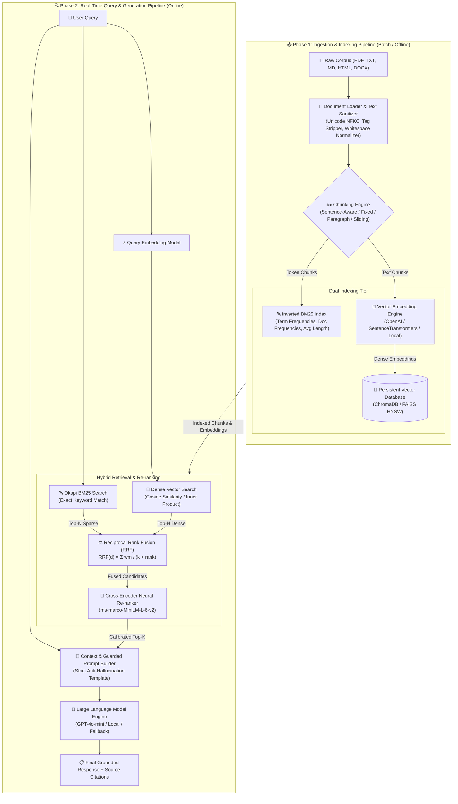
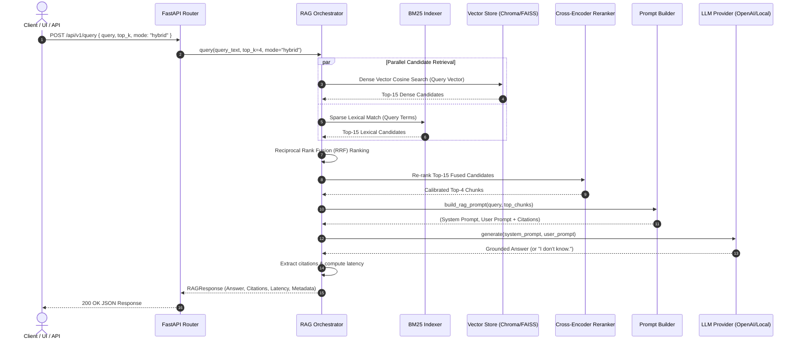

# 🏛️ System Architecture & Engineering Design

## 📌 1. Executive Summary & Objective

The **Production-Ready Retrieval-Augmented Generation (RAG) Pipeline** is an enterprise-grade AI architecture designed to solve the two foundational shortcomings of static Large Language Models (LLMs):
1. **Knowledge Latency**: Inability to reflect proprietary or real-time data beyond the model's pre-training cutoff.
2. **Hallucination Risk**: Generation of plausible yet factually incorrect statements when answering specialized domain queries.

By decoupling the language model's parametric memory from non-parametric external vector storage, the system ensures verifiable, deterministic, and context-grounded responses with verbatim source citations.

---

## 🏗️ 2. High-Level System Architecture

---

## ⚙️ 3. Detailed Data Flow & Execution Sequence

---

## 🧩 4. Core Subsystems & Modular Responsibilities

### 4.1 Ingestion Subsystem (`src/ingestion/`)
- **`DocumentLoader`**: Factory that loads files based on mime/extension (`.pdf`, `.md`, `.txt`, `.html`, `.docx`).
- **`TextCleaner`**: Normalizes Unicode to NFKC format, strips HTML boilerplates and zero-width artifacts, and standardizes multi-newline spacing.
- **`BaseChunker` Hierarchy**:
  - `SentenceAwareChunker`: Grammatical sentence boundary detection using regular expression lookaheads `(?<=[.!?])\s+(?=[A-Z0-9])`.
  - `FixedSizeChunker`: Exact token/character windowing with sliding stride.
  - `ParagraphAwareChunker`: Structural newline boundary preservation with overflow splitting.
  - `SlidingWindowChunker`: Continuous overlapping token strides.

### 4.2 Embedding & Vector Database Subsystem (`src/embeddings/`, `src/vector_store/`)
- **`BaseEmbeddingModel` Protocol**: Provides unified document batching (`embed_documents`) and query encoding (`embed_query`).
  - `OpenAIEmbeddingModel`: Utilizes `text-embedding-3-small` (1536 dims) or `text-embedding-3-large` (3072 dims).
  - `SentenceTransformerEmbeddingModel`: Utilizes `all-MiniLM-L6-v2` for localized inference.
  - `MockEmbeddingModel`: Deterministic, high-dimensional hashing vectorizer for zero-dependency test pipelines.
- **`BaseVectorStore` Protocol**:
  - `ChromaVectorStore`: Persistent SQLite + HNSW cosine index.
  - `FAISSVectorStore`: High-speed vector index (`IndexFlatIP`) with JSON metadata persistence.

### 4.3 Retrieval & Ranking Subsystem (`src/retrieval/`)
- **`BM25Retriever`**: Clean Python implementation of Okapi BM25 ($k_1=1.5, b=0.75$) with Robertson-Spärck Jones IDF.
- **`DenseRetriever`**: High-dimensional cosine distance similarity.
- **`HybridRetriever`**: Fuses lexical keyword matches with semantic vectors using **Reciprocal Rank Fusion (RRF)**:
  $$\text{RRF}(d) = \sum_{m \in \{\text{dense}, \text{bm25}\}} \frac{w_m}{k + \text{rank}_m(d)}$$
- **`CrossEncoderReranker`**: Re-ranks the top 15-20 candidates using cross-attention models (`cross-encoder/ms-marco-MiniLM-L-6-v2`).

### 4.4 Generation & Guardrails Subsystem (`src/generation/`)
- **`build_rag_prompt`**: Formats candidate chunks into `[CHUNK 1]`, `[CHUNK 2]` structures with source paths and similarity scores.
- **Strict Grounding Contract**: Prompt directives force the LLM to refuse unsupported questions using the exact fallback string: `"I don't know."`

---

## 📊 5. Architectural Trade-offs & Design Decisions

| Decision | Alternative Considered | Selected Rationale |
| :--- | :--- | :--- |
| **Hybrid Search (Dense + BM25)** | Dense Only | Dense vectors struggle with exact acronyms, serial codes, and technical keys. Hybrid search provides the highest recall across conceptual and keyword queries. |
| **Sentence-Aware Chunking** | Fixed Token Slicing | Fixed slicing splits thoughts across boundaries. Sentence-aware chunking maintains semantic integrity of facts and clauses. |
| **Dual Vector Store Adapters** | Single DB Binding | Interface abstraction (`BaseVectorStore`) enables drop-in switching between ChromaDB (cloud/persistent) and FAISS (low-latency high-throughput). |
| **Pydantic v2 Domain Models** | Plain Python Dictionaries | Type-safe runtime validation, zero-cost schema serialization, and automatic FastAPI OpenAPI specification generation. |

---

## 🔒 6. Security & Production Hardening

1. **Zero-Trust Input Sanitization**: Strips dangerous script tags and malicious control sequences before indexing.
2. **Environment Variable Secret Management**: API keys are isolated via Pydantic `BaseSettings` and `.env` files.
3. **Container Isolation**: Multi-stage Docker container running with non-root security principles and explicit volume mounts for index persistence.
