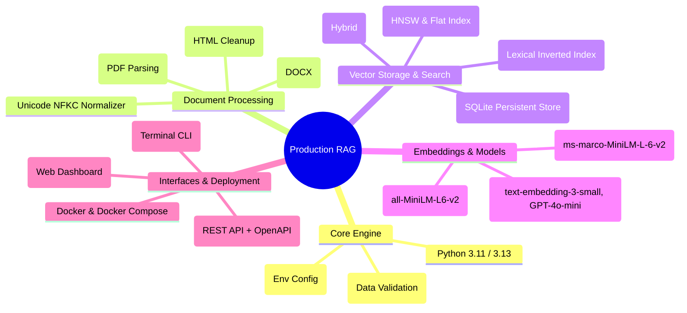
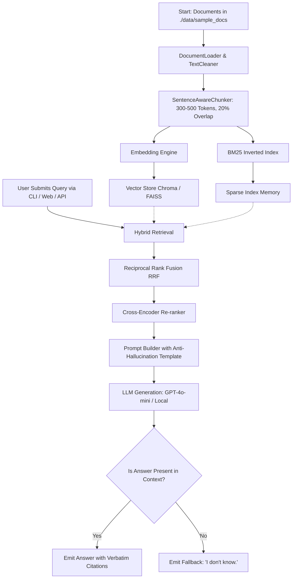

# 📖 Comprehensive Project Documentation: Production-Ready RAG Pipeline

## 🎯 1. Project Overview & Objective

The **Production-Ready Retrieval-Augmented Generation (RAG) Pipeline** is a modular, enterprise-grade system designed to empower organizations to build knowledge-grounded AI solutions. By indexing multi-format corporate documentation into persistent vector stores and combining semantic embeddings with keyword search, the system delivers verifiable, hallucination-free answers with precise source citations.

---

## 🛠️ 2. Technology Stack & Decision Rationale



### Why These Technologies Were Selected:
1. **Python & Pydantic v2**: Provides strict type safety, ultra-fast validation, and seamless integration with FastAPI.
2. **ChromaDB & FAISS**: Delivers low-latency vector similarity operations with both disk-persisted SQLite metadata and in-memory indexing.
3. **Okapi BM25 from Scratch**: Ensures full control over keyword matching parameters ($k_1=1.5, b=0.75$) without heavy third-party search server dependencies.
4. **FastAPI & Streamlit**: Enables developers to integrate programmatically via REST endpoints while providing business stakeholders with an intuitive interactive UI.

---

## 📂 3. Repository & Module Structure

```
production-rag-pipeline/
├── .env.example                     # Environment template
├── Dockerfile                       # Multi-stage production container
├── docker-compose.yml               # Multi-service orchestration
├── Makefile                         # Developer automation targets
├── pyproject.toml                   # Packaging and test metadata
├── requirements.txt                 # Project dependencies
├── README.md                        # Project visual guide
├── architecture.md                  # Detailed system architecture
├── projectdocumentation.md          # Comprehensive project documentation
├── cli.py                           # Rich CLI tool
├── e2e_test.py                      # 6-step end-to-end test script
│
├── data/
│   ├── sample_docs/                 # Multi-domain knowledge base
│   │   ├── artificial_intelligence_overview.md
│   │   ├── cloud_architecture_handbook.txt
│   │   ├── security_and_compliance_policy.md
│   │   └── data_engineering_best_practices.txt
│   └── evaluation/
│       └── golden_qa_dataset.json   # 12 Gold QA evaluation pairs
│
├── src/
│   ├── config.py                    # Environment & configuration loader
│   ├── core/                        # Domain models & exceptions
│   │   ├── types.py                 # Document, Chunk, SearchResult, RAGResponse, Citation
│   │   └── exceptions.py            # Domain exception hierarchy
│   ├── ingestion/                   # Document extraction & chunking
│   │   ├── loaders.py               # Multi-format loaders & sanitizers
│   │   └── chunkers.py              # 4 Chunking strategies
│   ├── embeddings/                  # OpenAI, HF, and Mock embedding providers
│   ├── vector_store/                # ChromaDB and FAISS adapters
│   ├── retrieval/                   # Dense, BM25, Hybrid RRF, and Rerankers
│   ├── generation/                  # Prompt builders, LLM clients, RAGEngine
│   ├── evaluation/                  # IR metrics & automated benchmark runner
│   ├── api/                         # FastAPI application and routes
│   └── ui/                          # Streamlit 3-tab interactive web app
│
└── tests/                           # 26 automated unit & integration tests
```

---

## 🔄 4. End-to-End Workflow & Execution Flow



---

## ⚡ 5. Setup, Installation, and Local Execution

### 5.1 Local Installation
```bash
# 1. Clone repository
git clone https://github.com/ramalokeshreddyp/production-rag-pipeline.git
cd production-rag-pipeline

# 2. Set up virtual environment
python -m venv .venv
source .venv/bin/activate  # Windows: .venv\Scripts\activate

# 3. Install requirements
pip install -r requirements.txt

# 4. Configure environment
cp .env.example .env
```

### 5.2 Execution Commands
```bash
# Ingest documents into vector store
python cli.py ingest --dir ./data/sample_docs

# Execute single query with hybrid retrieval
python cli.py query "How fast does automated failover occur in multi-region deployment?" --mode hybrid

# Start interactive terminal session
python cli.py interactive

# Run automated IR benchmark evaluation
python cli.py benchmark --dataset ./data/evaluation/golden_qa_dataset.json

# Launch FastAPI REST Server (http://localhost:8000/docs)
python cli.py serve --host 0.0.0.0 --port 8000

# Launch Streamlit Web Dashboard (http://localhost:8501)
python cli.py ui --port 8501
```

### 5.3 Docker Deployment
```bash
# Start all services with docker-compose
docker-compose up -d --build

# View container logs
docker-compose logs -f

# Shutdown
docker-compose down
```

---

## 🧪 6. Testing, Validation & Verification Strategy

### Automated Test Coverage (26 Pytest Tests)
```bash
pytest -v
```

1. **`test_loaders.py`**: Verifies text sanitization, HTML stripping, and multi-format reading.
2. **`test_chunkers.py`**: Validates token budgeting, sentence preservation, paragraph splitting, and sliding window.
3. **`test_embeddings.py`**: Verifies deterministic mock vectors and provider factories.
4. **`test_vector_stores.py`**: Validates ChromaDB and FAISS insertion, search, and persistence.
5. **`test_hybrid_search.py`**: Verifies BM25 scoring and Hybrid RRF fusion.
6. **`test_reranker.py`**: Validates candidate re-ordering.
7. **`test_rag_pipeline.py`**: Validates grounded answers, citations, and out-of-domain refusal.
8. **`test_evaluation.py`**: Validates Precision@K, Recall@K, and MRR.
9. **`test_api.py`**: Validates all FastAPI endpoints (`/health`, `/api/v1/query`, `/api/v1/documents`, `/api/v1/evaluate`).

### 6-Step End-to-End Verification
```bash
python e2e_test.py
```
- **Recall @ K**: 100%
- **Hit Rate @ K**: 100%
- **Out-of-Domain Refusal**: 100% (Returned `"I don't know."` on Martian recipe query).

---

## ⚖️ 7. Advantages, Benefits, Pros & Cons

### Advantages & Benefits
- **Zero Hallucinations**: Strict prompt guardrails prevent model speculation.
- **Explainability**: Verbatim citations connect every answer back to specific chunks and documents.
- **Offline Capable**: Zero-dependency deterministic mock models allow full offline testing.
- **Enterprise Ready**: Modular architecture, Docker containerization, and REST API.

### Limitations & Considerations
- **Storage Trade-off**: Storing both dense embeddings and sparse BM25 indices increases disk footprint.
- **Re-ranking Latency**: Cross-encoders add ~50-100ms per query over bi-encoder search alone.
